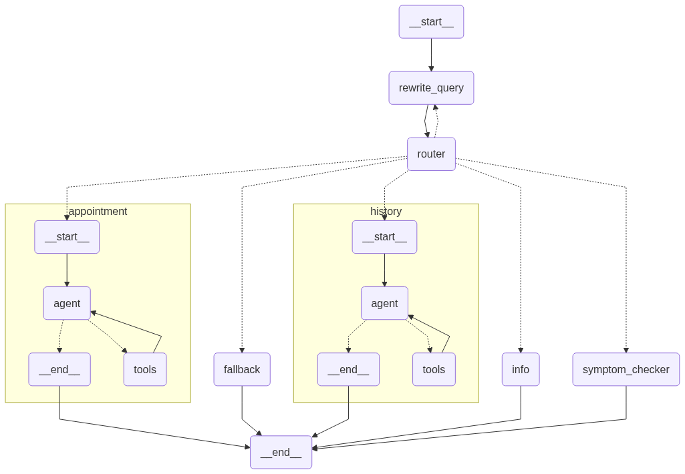

# 🏥 Kailash Hospital AI Agent


A full-stack conversational hospital assistant powered by Gemini, LangGraph, Retrieval-Augmented Generation, and MCP (Model Context Protocol) server-based tool calling — complete with FastAPI backend, TailwindCSS web UI, and PostgreSQL-driven memory and appointment management.

---

## 🚀 Overview
Kailash Hospital AI Agent is an intelligent, full-stack hospital assistant designed to streamline patient interaction, symptom triage, and appointment workflows via natural conversation. It offers a rich chat interface powered by Gemini (gemini-2.0-flash-001) and a modular backend built using LangGraph, FastAPI, PostgreSQL, and MCP (Model Context Protocol) for advanced tool integration.

**Key Capabilities:**
- 🔍 Answer factual queries about Kailash Hospital (departments, timings, services, etc.)
- 🩺 Perform smart symptom checking with triage suggestions and department routing
- 📅 Handle appointment workflows (viewing, scheduling, updating) using PostgreSQL logic
- 🧠 Track memory, patient state, and chat history persistently via PostgreSQL
- 💬 Serve conversations through a web-based chat UI styled with Tailwind CSS
- 🌐 Use MCP server-based tools (TavilyMCP) for real-time, high-quality web search in symptom triage and information retrieval

---

## ✨ Features
- **FastAPI-powered Backend:** Robust, asynchronous API layer for the hospital agent.
- **Gemini LLM + LangGraph State Machine:** Structured, node-based reasoning over user messages.
- **Retrieval-Augmented Generation (RAG):** Answers grounded in official Kailash Hospital knowledge base using HuggingFace embeddings + Chroma.
- **PostgreSQL-Based Logic:** Appointment workflows and persistent memory via PostgreSQL.
- **MCP Server Integration:** Uses MCP (Model Context Protocol) for modular tool integration, including TavilyMCP for advanced, real-time web search in medical triage and information flows.
- **Modular Tooling:** Easily extend the agent with new tools and capabilities via the MCP protocol.
- **Beautiful Tailwind UI:** Minimal, responsive HTML+Tailwind interface.

---

## 🛠️ Tech Stack
| Layer      | Tech                                                                 |
|------------|----------------------------------------------------------------------|
| UI         | HTML5, Tailwind CSS                                                 |
| Backend    | FastAPI (Python)                                                    |
| LLM        | Gemini (gemini-2.0-flash-001) via ChatGoogleGenerativeAI            |
| Orchestration | LangGraph                                                        |
| RAG        | RetrievalQA, Chroma, HuggingFace (MiniLM-L6-v2)                     |
| Memory     | LangGraph SqliteSaver (persistent, thread-based)                    |
| Database   | PostgreSQL + SQL logic for appointments and patient history         |
| Tools      | MCP (Model Context Protocol), TavilyMCP, LangGraph SQL agent        |

---

## 🖥️ Architecture



```
UI (Tailwind HTML) → FastAPI → LangGraph → Router
  ├─ InfoNode → RAGChain → ChromaDB
  ├─ SymptomChecker → MCP ToolNode (TavilyMCP)
  └─ Appointment → SQLAgent → PostgreSQL
```

---

## 🏁 Getting Started

### Option 1: Using Docker (Recommended)

#### 1. Clone the Repository
```bash
git clone https://github.com/yourname/hospital-agent.git
cd hospital-agent/Hospital_management_system
```

#### 2. Environment Setup
- Create a `.env` file with your API keys:
  ```env
  GOOGLE_API_KEY=your-gemini-api-key
  TAVILY_API_KEY=your-tavily-api-key
  ```

#### 3. Run with Docker Compose
```bash
docker-compose up -d
```

#### 4. Access the UI
Open your browser at [http://localhost:8000](http://localhost:8000)

### Option 2: Manual Setup

#### 1. Clone the Repository
```bash
git clone https://github.com/yourname/hospital-agent.git
cd hospital-agent/Hospital_management_system
```

#### 2. Install Python Dependencies
```bash
pip install -r requirements.txt
```

#### 3. Install Node.js and MCP Tools
- **Node.js** is required for MCP servers. [Download Node.js](https://nodejs.org/)
- MCP tools are run via `npx` (no global install needed):
  - The backend will launch MCP servers using:
    ```bash
    npx -y tavily-mcp@0.1.4
    ```
- **Tavily API Key:**
  - Get your API key from [Tavily](https://app.tavily.com/).
  - Add it to your `.env` file:
    ```env
    TAVILY_API_KEY=your-tavily-api-key
    ```

#### 4. Environment Setup
- Add your Gemini API key to `.env`:
  ```env
  GOOGLE_API_KEY=your-gemini-api-key
  ```
- Prepare `kailash_info.txt` with hospital data (sample provided).
- Set up your database with the correct schema for appointments/patients.

#### 5. Run the FastAPI Server
```bash
uvicorn api_setup:app_fastapi --host 0.0.0.0 --port 8000
```

#### 6. Access the UI
Open your browser at [http://localhost:8000](http://localhost:8000)

---

## 💬 Example Interactions

```
User: I have mild chest pain and shortness of breath.
Assistant: These symptoms may indicate a cardiac issue. (Uses MCP tools to search for latest guidelines.) I recommend consulting the Cardiology department. Would you like help accessing appointment options?
```

---

## 📂 Project Structure

```
Hospital_management_system/
├── agent_runnable.py         # Main agent logic
├── api_setup.py              # FastAPI app
├── sql_agent.py              # SQL agent for appointments
├── nodes/                    # LangGraph nodes
├── kailash_info_store/       # Info retrieval logic
├── databases/                # PostgreSQL DB and helpers
├── kailash_info.txt          # Hospital info knowledge base
├── chatbot.html              # Web UI
├── hospital_agent_graph.png  # Architecture diagram
└── ...
```

---

## 🧩 MCP Server Integration
- **What is MCP?**
  - MCP (Model Context Protocol) is a protocol for connecting AI agents to external tools and data sources.
  - It enables dynamic, modular tool integration through standardized server interfaces.
- **How is it used?**
  - The backend launches MCP servers (like TavilyMCP) via `npx` and connects using the `mcp` and `langchain-mcp-adapters` Python packages.
  - The symptom checker and other nodes can invoke MCP tools for up-to-date information and external functionality.
- **Current MCP Tools:**
  - **TavilyMCP:** Provides high-quality, real-time web search for medical information and symptom analysis.
- **Setup:**
  - Requires Node.js and appropriate API keys in your `.env` file.
  - No manual server start needed; the backend handles launching MCP servers as needed.

---

## 🤝 Contributing
Pull requests are welcome! For major changes, please open an issue first to discuss what you would like to change.

---

## 📄 License
[MIT](LICENSE)

---

**Kailash Hospital AI Agent** — Smart, conversational healthcare for everyone.