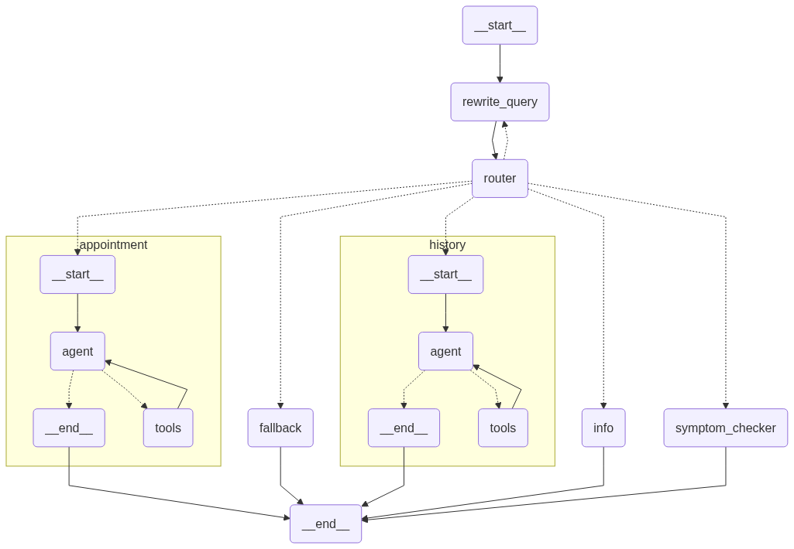

# 🏥 Kailash Hospital AI Agent


[](https://hospital-management-agent-71h8.onrender.com/chatbot.html)

A full-stack conversational hospital assistant powered by Groq (Llama 3.3), LangGraph, Retrieval-Augmented Generation, and MCP (Model Context Protocol) server-based tool calling — complete with FastAPI backend, TailwindCSS web UI, and SQLite-driven memory and appointment management.

**🔗 Live demo:** [hospital-management-agent-71h8.onrender.com/chatbot.html](https://hospital-management-agent-71h8.onrender.com/chatbot.html)
> Hosted on Render's free tier — it spins down after 15 minutes of inactivity, so the first
> message after a while may take ~30–50s to wake the server up. Subsequent replies are fast.

---

## 🚀 Overview
Kailash Hospital AI Agent is an intelligent, full-stack hospital assistant designed to streamline patient interaction, symptom triage, and appointment workflows via natural conversation. It offers a rich chat interface powered by Groq (Llama 3.3 70B) and a modular backend built using LangGraph, FastAPI, SQLite, and MCP (Model Context Protocol) for advanced tool integration.

**Key Capabilities:**
- 🔍 Answer factual queries about Kailash Hospital (departments, timings, services, etc.)
- 🩺 Perform smart symptom checking with triage suggestions and department routing
- 📅 Handle appointment workflows (viewing, scheduling, updating) using SQLite logic
- 🧠 Track memory, patient state, and chat history persistently via SQLite
- 💬 Serve conversations through a web-based chat UI styled with Tailwind CSS
- 🌐 Use MCP server-based tools (TavilyMCP) for real-time, high-quality web search in symptom triage and information retrieval

---

## ✨ Features
- **FastAPI-powered Backend:** Robust, asynchronous API layer for the hospital agent.
- **Groq LLM + LangGraph State Machine:** Structured, node-based reasoning over user messages.
- **Retrieval-Augmented Generation (RAG):** Answers grounded in official Kailash Hospital knowledge base using HuggingFace embeddings + Chroma.
- **SQLite-Based Logic:** Appointment workflows and persistent memory via SQLite.
- **MCP Server Integration:** Uses MCP (Model Context Protocol) for modular tool integration, including TavilyMCP for advanced, real-time web search in medical triage and information flows.
- **Modular Tooling:** Easily extend the agent with new tools and capabilities via the MCP protocol.
- **Resilient by Design:** Web-search results and history are token-capped to respect provider rate limits; the UI auto-retries transient errors (cold starts / redeploys) and degrades gracefully.
- **Beautiful Tailwind UI:** Minimal, responsive chat interface with a welcome state, suggested prompts, and formatted replies.

---

## 🛠️ Tech Stack
| Layer      | Tech                                                                 |
|------------|----------------------------------------------------------------------|
| UI         | HTML5, Tailwind CSS                                                 |
| Backend    | FastAPI (Python)                                                    |
| LLM        | Groq — Llama 3.3 70B (reasoning) + Llama 3.1 8B (SQL tools) via langchain-groq |
| Orchestration | LangGraph                                                        |
| RAG        | RetrievalQA, Chroma, HuggingFace (MiniLM-L6-v2)                     |
| Memory     | LangGraph SqliteSaver (persistent, thread-based)                    |
| Database   | SQLite + SQL logic for appointments and patient history         |
| Tools      | MCP (Model Context Protocol), TavilyMCP, LangGraph SQL agent        |

---

## 🖥️ Architecture



```
UI (Tailwind HTML) → FastAPI → LangGraph
        │
   RewriteQuery → Router ──► intent
        ├─ Info          → RAG chain (Chroma + MiniLM)
        ├─ SymptomChecker → MCP ToolNode (TavilyMCP web search)
        ├─ Appointment    → SQL agent → SQLite
        ├─ History        → SQLite
        └─ Fallback
```

Every turn is first normalised by **RewriteQuery**, classified by the **Router** (Groq
structured output) into one of the intents above, then handled by the matching node.
Conversation state is checkpointed per patient via LangGraph's async SQLite saver.

---

## 🏁 Getting Started

### Option 1: Using Docker (Recommended)

#### 1. Clone the Repository
```bash
git clone https://github.com/Kabir2005/Hospital-Management-Agent.git
cd Hospital-Management-Agent/Hospital_management_system
```

#### 2. Environment Setup
- Create a `.env` file with your API keys:
  ```env
  GROQ_API_KEY=your-groq-api-key
  TAVILY_API_KEY=your-tavily-api-key
  ```

#### 3. Run with Docker Compose
```bash
docker-compose up -d
```

#### 4. Access the UI
Open your browser at [http://localhost:8000](http://localhost:8000)

### Option 2: Manual Setup

#### 1. Clone the Repository
```bash
git clone https://github.com/Kabir2005/Hospital-Management-Agent.git
cd Hospital-Management-Agent/Hospital_management_system
```

#### 2. Install Python Dependencies
```bash
pip install -r requirements.txt
```

#### 3. Install Node.js and MCP Tools
- **Node.js** is required for MCP servers. [Download Node.js](https://nodejs.org/)
- MCP tools are run via `npx` (no global install needed):
  - The backend will launch MCP servers using:
    ```bash
    npx -y tavily-mcp@0.1.4
    ```
- **Tavily API Key:**
  - Get your API key from [Tavily](https://app.tavily.com/).
  - Add it to your `.env` file:
    ```env
    TAVILY_API_KEY=your-tavily-api-key
    ```

#### 4. Environment Setup
- Copy `.env.example` to `.env` and fill in your keys:
  ```env
  GROQ_API_KEY=your-groq-api-key
  TAVILY_API_KEY=your-tavily-api-key
  ```
- `kailash_info.txt` (the RAG knowledge base) is included.

#### 5. Seed the SQLite database
Creates `databases/hospital.db` with sample doctors, appointments, and patient history:
```bash
cd databases && python db_setup.py && cd ..
```

#### 6. Run the FastAPI Server
```bash
uvicorn api_setup:app_fastapi --host 0.0.0.0 --port 8000
```

#### 7. Access the UI
Open [http://localhost:8000](http://localhost:8000) — the chat UI loads at the root.

---

## ⚙️ Configuration

All configuration is via environment variables (in `.env`, or your host's dashboard):

| Variable | Required | Default | Purpose |
|----------|----------|---------|---------|
| `GROQ_API_KEY` | ✅ | — | Groq API key — powers all LLM calls ([console.groq.com/keys](https://console.groq.com/keys)) |
| `TAVILY_API_KEY` | ✅ | — | Tavily key — the symptom checker's web-search MCP tool ([app.tavily.com](https://app.tavily.com/)) |
| `GROQ_MODEL` | — | `llama-3.3-70b-versatile` | Model for reasoning nodes (routing, info, symptom triage) |
| `GROQ_SQL_MODEL` | — | `llama-3.1-8b-instant` | Model for the SQL tool agent (more reliable at tool calling) |
| `PORT` | — | `7860` | Port the server binds to (cloud hosts inject this automatically) |

> **Free-tier note:** Groq's free tier caps `llama-3.3-70b` at ~12k tokens/minute. The agent
> trims large web-search results and conversation history to stay within that budget; under
> heavy back-to-back use you may still hit a rate limit, which the UI surfaces gracefully and
> retries.

---

## 💬 Example Interactions

```
User: I have a sore throat and mild fever — what should I do?
Assistant:
  🔍 Follow-up Questions: None
  📋 Possible Causes & Summary: Symptoms may point to a viral or bacterial
     infection (cold, flu, or strep throat)… rest, fluids, and monitoring are
     advised; see a doctor if it worsens.
  🏥 Suggested Department: ENT
  Would you like to book an appointment with an ENT specialist?

User: What appointments do I have booked?
Assistant: You have appointments booked with Dr. Mahesh Sharma on 2025-06-18 10:30
           and Dr. Arun Kumar on 2025-06-20 09:00.
```

---

## 📂 Project Structure

```
Hospital_management_system/
├── agent_runnable.py         # Main agent logic
├── api_setup.py              # FastAPI app
├── sql_agent.py              # SQL agent for appointments
├── nodes/                    # LangGraph nodes
├── kailash_info_store/       # Info retrieval logic
├── databases/                # SQLite DB and helpers
├── kailash_info.txt          # Hospital info knowledge base
├── chatbot.html              # Web UI
├── hospital_agent_graph.png  # Architecture diagram
└── ...
```

---

## 🧩 MCP Server Integration
- **What is MCP?**
  - MCP (Model Context Protocol) is a protocol for connecting AI agents to external tools and data sources.
  - It enables dynamic, modular tool integration through standardized server interfaces.
- **How is it used?**
  - The backend launches MCP servers (like TavilyMCP) via `npx` and connects using the `mcp` and `langchain-mcp-adapters` Python packages.
  - The symptom checker and other nodes can invoke MCP tools for up-to-date information and external functionality.
- **Current MCP Tools:**
  - **TavilyMCP:** Provides high-quality, real-time web search for medical information and symptom analysis.
- **Setup:**
  - Requires Node.js and appropriate API keys in your `.env` file.
  - No manual server start needed; the backend handles launching MCP servers as needed.

---

## 🚀 Deploy to Render

This app is a long-running server (FastAPI + a Node/Tavily MCP subprocess + SQLite), so it
belongs on a container host, **not** a serverless platform like Vercel. [Render](https://render.com)
builds the included `Dockerfile` directly, and its free tier needs no credit card.

1. Push this repo to GitHub (already done).
2. On [render.com](https://render.com): **New + → Web Service** → connect your GitHub account →
   select `Hospital-Management-Agent`.
3. **Set the Root Directory** — this app's `Dockerfile` lives in the `Hospital_management_system/`
   subfolder, so in the config screen enter:
   ```
   Hospital_management_system
   ```
   (Otherwise Render won't find the Dockerfile.) It should auto-detect the **Docker** environment
   from the Dockerfile there.
4. **Instance Type**: select **Free**.
5. Add environment variables:
   ```
   GROQ_API_KEY=your-groq-key
   TAVILY_API_KEY=your-tavily-key
   ```
   (Optional: `GROQ_MODEL`, `GROQ_SQL_MODEL` to override the defaults.)
6. Click **Create Web Service**. Render builds the image (~5 min first time) and gives you a URL
   like `https://<your-app>.onrender.com`.
7. Open `https://<your-app>.onrender.com/chatbot.html` for the chat UI.

A live instance is running at
**[hospital-management-agent-71h8.onrender.com/chatbot.html](https://hospital-management-agent-71h8.onrender.com/chatbot.html)**.

### What's inside the container (your DB question)

The image is fully self-contained:

- **Python + all deps** and **Node.js + Tavily MCP** (installed at build time).
- The **SQLite database** (`hospital.db`) — the entrypoint runs `db_setup.py` on first boot,
  so doctors/appointments/history are seeded automatically.
- The **Chroma RAG store** — rebuilt from `kailash_info.txt` on startup.

So you don't provision a separate database; SQLite is a file inside the container.

⚠️ **Two caveats of Render's free tier:**
- The container **spins down after 15 minutes of inactivity** — the first request after idle
  takes ~30–50s to wake up (cold start), then responses are fast.
- The filesystem is **ephemeral** — on every redeploy/restart the SQLite files reset (re-seeded
  fresh; any appointments booked at runtime or chat memory are lost). Fine for a demo. To
  **persist** data across deploys, add a [Render Disk](https://render.com/docs/disks) mounted
  at `/app/databases` (requires a paid instance type).

> The first request after a cold start also downloads the MiniLM embedding model from Hugging
> Face once — this adds to that initial wake-up time.

---

## 🤝 Contributing
Pull requests are welcome! For major changes, please open an issue first to discuss what you would like to change.

---

## 📄 License
[MIT](LICENSE)

---

**Kailash Hospital AI Agent** — Smart, conversational healthcare for everyone.