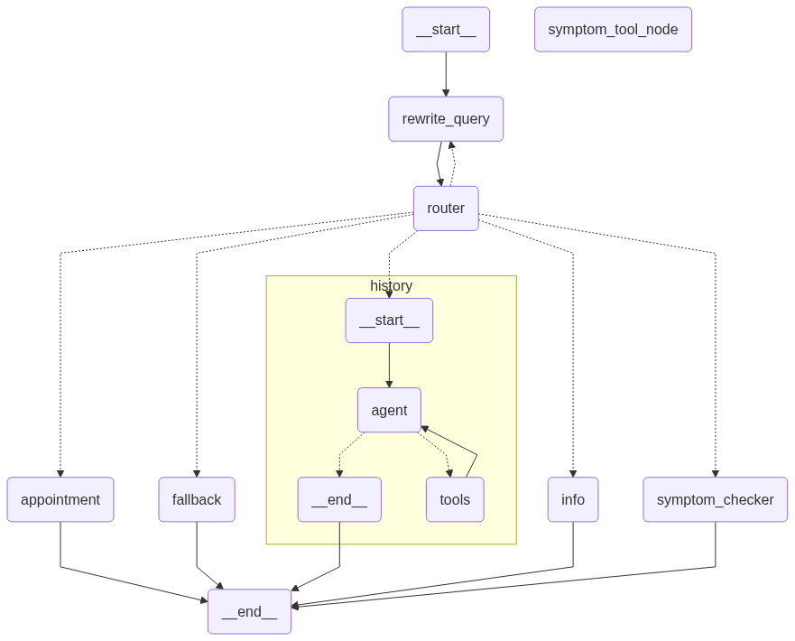

# 🏥 Kailash Hospital AI Agent


A full-stack conversational hospital assistant powered by Gemini, LangGraph, and Retrieval-Augmented Generation — complete with FastAPI backend, TailwindCSS web UI, and SQL-driven memory and appointment management.

---

## 🚀 Overview
Kailash Hospital AI Agent is an intelligent, full-stack hospital assistant designed to streamline patient interaction, symptom triage, and appointment workflows via natural conversation. It offers a rich chat interface powered by Gemini (gemini-2.0-flash-001) and a modular backend built using LangGraph, LangChain, FastAPI, and SQL (SQLite).

**Key Capabilities:**
- 🔍 Answer factual queries about Kailash Hospital (departments, timings, services, etc.)
- 🩺 Perform smart symptom checking with triage suggestions and department routing
- 📅 Handle appointment workflows (viewing, scheduling, updating) using SQL logic
- 🧠 Track memory, patient state, and chat history persistently via SQLite
- 💬 Serve conversations through a web-based chat UI styled with Tailwind CSS

---

## ✨ Features
- **FastAPI-powered Backend:** Robust, asynchronous API layer for the hospital agent.
- **Gemini LLM + LangGraph State Machine:** Structured, node-based reasoning over user messages.
- **Retrieval-Augmented Generation (RAG):** Answers grounded in official Kailash Hospital knowledge base using HuggingFace embeddings + Chroma.
- **SQL-Based Logic:** Appointment workflows and persistent memory via SQLite.
- **Beautiful Tailwind UI:** Minimal, responsive HTML+Tailwind interface.
- **Search + Tools Integration:** Supports external search tools and custom APIs for symptom diagnosis.

---

## 🛠️ Tech Stack
| Layer      | Tech                                                                 |
|------------|----------------------------------------------------------------------|
| UI         | HTML5, Tailwind CSS                                                 |
| Backend    | FastAPI (Python)                                                    |
| LLM        | Gemini (gemini-2.0-flash-001) via ChatGoogleGenerativeAI            |
| Orchestration | LangGraph                                                        |
| RAG        | RetrievalQA, Chroma, HuggingFace (MiniLM-L6-v2)                     |
| Memory     | LangGraph SqliteSaver (persistent, thread-based)                    |
| Database   | SQLite + SQL logic for appointments and patient history             |
| Tools      | TavilySearchResults, Symptom API, LangChain SQL agent               |

---

## 🖥️ Architecture



```
UI (Tailwind HTML) → FastAPI → LangGraph → Router
  ├─ InfoNode → RAGChain → ChromaDB
  ├─ SymptomChecker → ToolNode
  └─ Appointment → SQLAgent → SQLite
```

---

## 🏁 Getting Started

### 1. Clone the Repository
```bash
git clone https://github.com/yourname/hospital-agent.git
cd hospital-agent/Hospital_management_system
```

### 2. Install Dependencies
```bash
pip install -r requirements.txt
```

### 3. Environment Setup
- Add your Gemini API key to a `.env` file:
  ```env
  GEMINI_API_KEY=your-gemini-api-key
  ```
- Prepare `kailash_info.txt` with hospital data (sample provided).
- Set up `hospital.db` (SQLite) with the correct schema for appointments/patients.

### 4. Run the FastAPI Server
```bash
uvicorn api_setup:app --reload
```

### 5. Access the UI
Open your browser at [http://localhost:8000](http://localhost:8000)

---

## 💬 Example Interactions

```
User: What are the OPD timings on Sunday?
Assistant: OPD is open from 10 AM to 1 PM on Sundays for select departments. Please check with the reception for your specialty.

User: I have mild chest pain and shortness of breath.
Assistant: These symptoms may indicate a cardiac issue. I recommend consulting the Cardiology department. Would you like help accessing appointment options?

User: Show upcoming appointments for Kabir Gupta.
Assistant: You have an appointment with Dr. R. Sharma (Cardiology) at 11:00 AM on Monday. Would you like to reschedule or cancel it?
```

---

## 📂 Project Structure

```
Hospital_management_system/
├── agent_runnable.py         # Main agent logic
├── api_setup.py              # FastAPI app
├── sql_agent.py              # SQL agent for appointments
├── nodes/                    # LangGraph nodes
├── kailash_info_store/       # Info retrieval logic
├── databases/                # SQLite DB and helpers
├── kailash_info.txt          # Hospital info knowledge base
├── chatbot.html              # Web UI
├── hospital_agent_graph.png  # Architecture diagram
└── ...
```

---

## 🤝 Contributing
Pull requests are welcome! For major changes, please open an issue first to discuss what you would like to change.

---

## 📄 License
[MIT](LICENSE)

---

**Kailash Hospital AI Agent** — Smart, conversational healthcare for everyone.